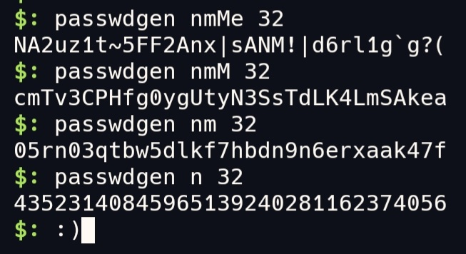

<html>
<h1 align="center">passwd-gen</h1>

  Passwd-gen é um simples utilitário, feito em bash script, cunhado para gerar senhas em seu terminal.
  
  Esta ferramenta gera senhas com números, letras minúsculas e maiúsculas, e caracteres especiais.

  Simplifique seu cotidiano evitando utilizar ferramentas online, isto pode garantir uma maior segurança.

<code>passwdgen [OPÇÕES] [QUANTIA]</code>

 OPÇÕES:
  
n - números;
  
m - letras minúsculas;

M - letras maiúsculas;

e - caracteres especiais.

  
  Dica: Inclua o programa passwdgen em seu PATH para utilizar ele em qualquer local do seu terminal.

 donate bitcoin: bc1qq77c3w5l97da0pjn6d4dx9zueys29p799q7heq

</html>
